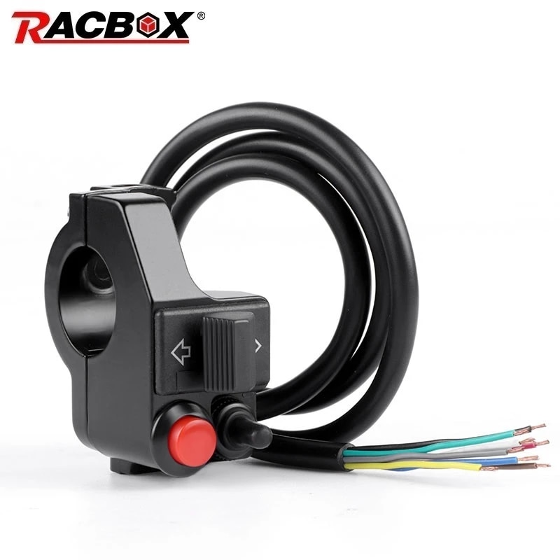
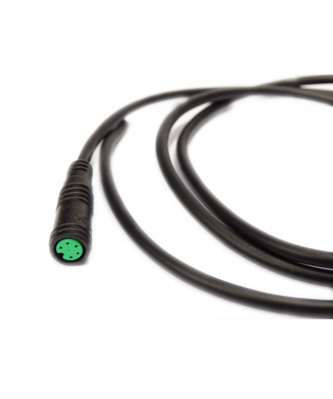

# Better switch cluster

- [Better switch cluster](#better-switch-cluster)
  - [Factory switch cluster](#factory-switch-cluster)
    - [Wire mapping](#wire-mapping)
  - [Switch cluster from AliExpress](#switch-cluster-from-aliexpress)
    - [Wire mapping](#wire-mapping-1)
  - [HIGO connector 5pin female](#higo-connector-5pin-female)
    - [Wire mapping](#wire-mapping-2)
  - [Final result](#final-result)
    - [Final wire mapping](#final-wire-mapping)

## Factory switch cluster

Factory installed switch cluster provides poor tactile feedback about whether turn signals or headlight are active.  
Easy fix for that is to use motorcycle switch cluster, but it takes a lot of space on handlebars.  
Let's find something more compact!

### Wire mapping

See [Wiring Diagram](../NamiDiagram.pdf)

| Pin position| Wire color | Function |
| --- | --- | --- |
| 1 | Red | Headlights `+V`|
| 2 | Black | `GND` |
| 3 | Blue | **Left** turn signal `+V` |
| 4 | Green | **Right** turn signal `+V` |
| 5 | Yellow | Horn `+V`|

## Switch cluster from AliExpress

I've ordered [this](https://aliexpress.com/item/1005004444097204.html) switch cluster from AliExpress  
  

### Wire mapping

Wire mapping is as folows (Remember, **Nami has permanent `GND`** and switched `+V`. Automotive world mainly uses permanent `+V` and switched `GND`)

| Wire color | Function |
| --- | --- |
| White | Turn signals `GND` |
| Red | **Left** turn signal |
| Black | **Right** turn signal |
| Yellow | Horn `GND` |
| Brown | Horn `GND` |
| Blue | Headlight `GND` |
| Grey | Headlight 1 |
| Green | Headlight 2 |

Light switch installed in this switch cluster is capable of switching 12V electricity. Nami Burn-E headlight works on 84V, thus it will weld itself.  
Safe solution is to permanently solder headlights before switch cluster and leave light switch not connected. Running headlights all the time increases your visibility and reduces risk of accidents.

## HIGO connector 5pin female

Also, you need 5-pin Higo female plug. I ordered [it](https://e-bikestuff.com/en/higo-connectors/58-higo-connector-5pin-female.html) at e-bike store in my country

### Wire mapping

Wire mapping is as folows (Remember, **Nami has permanent `GND`** and switched `+V`. Electrical world mainly uses permanent `+V` and switched `GND`)

| Pin position | Wire color |
| --- | --- |
| 1 | Orange |
| 2 | White |
| 3 | Brown |
| 4 | Green |
| 5 | Black |

## Final result

Looking at tables above, joining switch cluster and wire together requires soldering 4 `GND` lines together (Higo Headlights with Higo `GND` with Switch Cluster horn `GND` with Switch Cluster turn signals `GND`)

### Final wire mapping

| Pin position | Function | HIGO wire color | Switch cluster wire color |
| --- | --- | --- | ---- |
| 1 | Headlights `+V`| Orange, solder to pin 2 | None |
| 2 | `GND` | White | White & Yellow |
| 3 | **Left** turn signal `+V` | Brown | Red |
| 4 | **Right** turn signal `+V` | Green | Black |
| 5 | Horn `+V`| Black | Brown |
