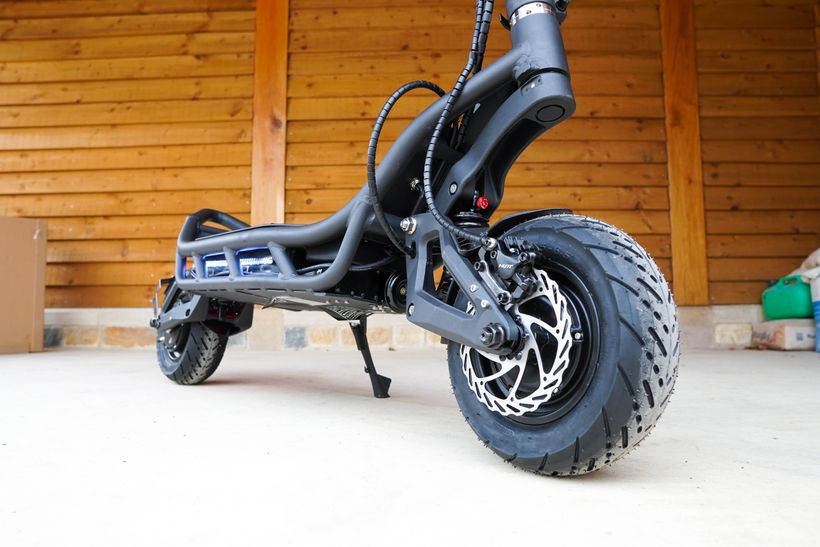
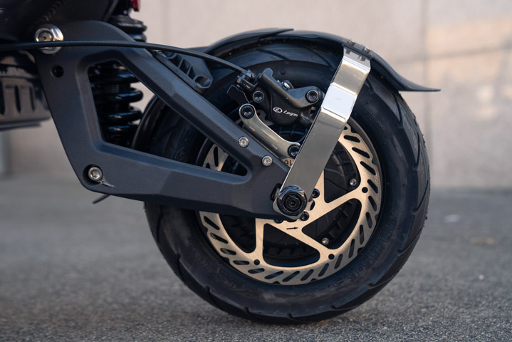
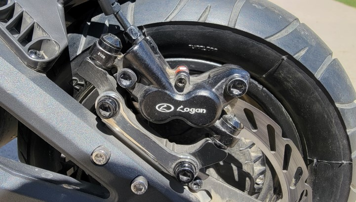
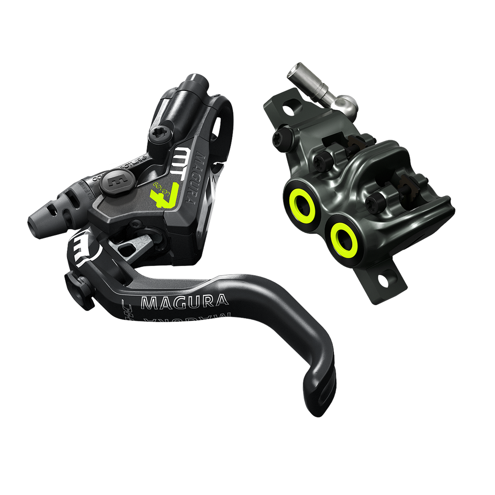
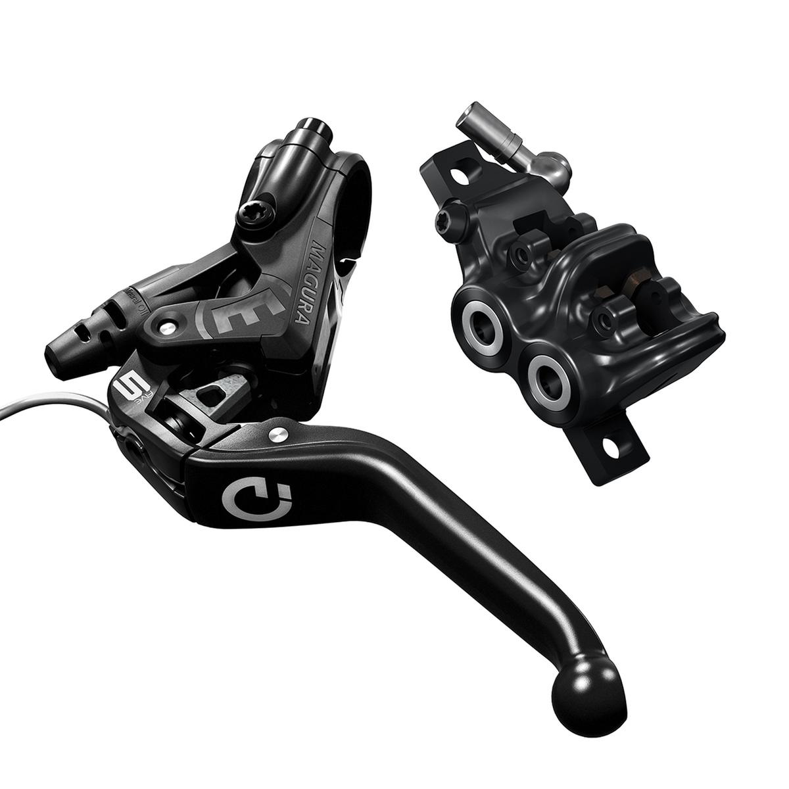
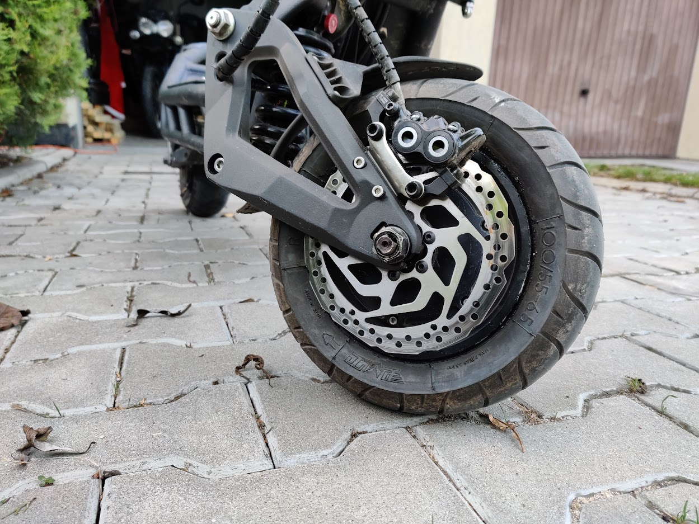

# Magura disc brakes

- [Magura disc brakes](#magura-disc-brakes)
  - [Factory brakes](#factory-brakes)
    - [First batches of 35Ah](#first-batches-of-35ah)
    - [Nami Burn-E 2 28Ah](#nami-burn-e-2-28ah)
    - [Nami Burn-E 2 MAX 32Ah](#nami-burn-e-2-max-32ah)
  - [Magura brakes](#magura-brakes)
    - [Magura MT5e vs Magura MT7](#magura-mt5e-vs-magura-mt7)
      - [Example of Nami on Magura MT5e brakes](#example-of-nami-on-magura-mt5e-brakes)
    - [Fixing brake caliper alignment](#fixing-brake-caliper-alignment)

## Factory brakes

Factory installed depends on manufacturing date and variant of a scooter.

### First batches of 35Ah

Initial batches of 35Ah Burn-E Vipers came with two-piston Nutt hydraulic brake calipers

### Nami Burn-E 2 28Ah

After creating of "second generation" of Burn-E with smaller, 28Ah, battery braking system was changed to two-piston Logan brakes.

### Nami Burn-E 2 MAX 32Ah

After creating of "second generation" of Burn-E with 32Ah, battery braking system was changed to four-piston Logan brakes.

## Magura brakes

While four-piston Logans provide very decent braking action, other brake systems tend to lack performance in demanding scenarios.
Magura brakes are known for their reliable performance and ease of use due to perfect feeling of brake force applied.  
Neat addition is a fact that regen braking is applied before friction braking is performed, so You can slow down without wearing down brake pads (and recovering some range!).

### Magura MT5e vs Magura MT7

Magura brakes are highly interchangable, it's like LEGO bricks.  
Let's compare visuals between MT7 brake caliper and MT5 brake calipers.  
  

Let's compare!

- Brake calipers are the same
  - Difference is in color decorative sealings
- Brake pump looks ~the same
  - MT7 brake pump is made from Carbotecture, MT5 is made from different material
- Brake levers are different
  - MT7 brake levers are for single-finger usage and provide bite point regulation via a knob
  - MT5e brake levers are for four-finger usage and provide bite point regulation via a hex screw.
  - MT5e brake lever provide HIGO connector for regenerative braking (and cutting-off electric propulsion!)
- Brake pads are different
  - MT7 provide four, smaller, brake pads.
  - MT5e provide two, larger, brake pads. Each brake pad spans across two brake pistons.
  - Brake pads are consumables, and due to brake calipers being the same, factory-installed brake pads doesn't matter in long run. Just swap them to variant you loke.

Verdict: Use what you want. Magura MT5e HIGO **closer** provide better performance/$ ratio. You can change brake pads to your taste. Also, getting MT7 and changing brake lever to MT5e variant is also (a more expensive) option.

#### Example of Nami on Magura MT5e brakes

As You can see, some part of brake rotor is not used.  
It is directly related to usage of factory IS-PM adapter (that black part below brake caliper).

### Fixing brake caliper alignment

Brobic Vriplat found a solution