## Magura MT5e - Nami Burn-e installation 
* [General info](#general-info)
* [Parts](#parts)
* [Installation](#installation)
* [Bleeding procedure](#bleeding procedure)
* [Setting](#setting)

## General info
The following description will apply to the installation of the Magura MT5e brake kit in the Higo Closer version. If you have the Opener type, there is a method to convert the brake handle microswitch to Closer mode. More information on this can be found at this link
https://youtu.be/A9rXYbLsmW8
	
## Parts
* Magura brake kit
* Magura brake bleeding kit
* Adapters for brake calipers- in my case I installed dedicated ones, ordered from 3Dxtreme
* Magura Storm HC 160mm brake discs
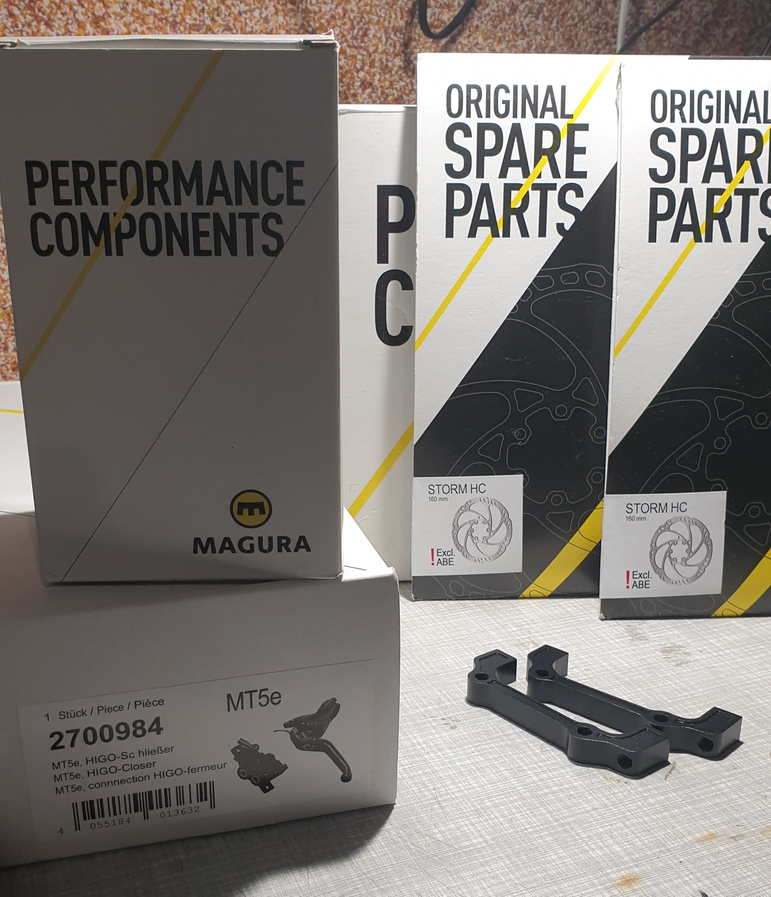
	
## Installation
We start the assembly process by preparing the Magura brakes. To do this, gently unscrew the vents of the door handles and pour the brake fluid into an empty container using a syringe.
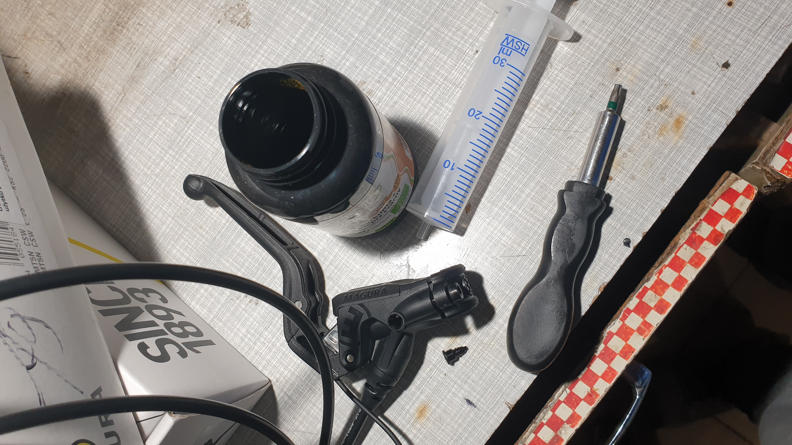
 Then, gently move the nut covers and unscrew the brake hoses from the handles in order to disconnect the brake hoses and then drain the remaining amount of fluid.
 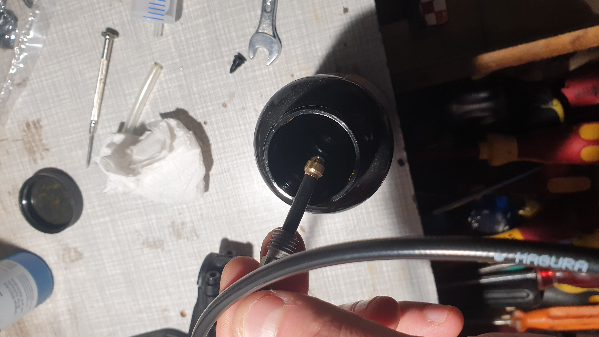
 Using pliers, we cut off the factory-forged ends of the wires. Important : Cut the ends of the brake hoses evenly. The template included with the Magura brake bleed kit can be used for this purpose
 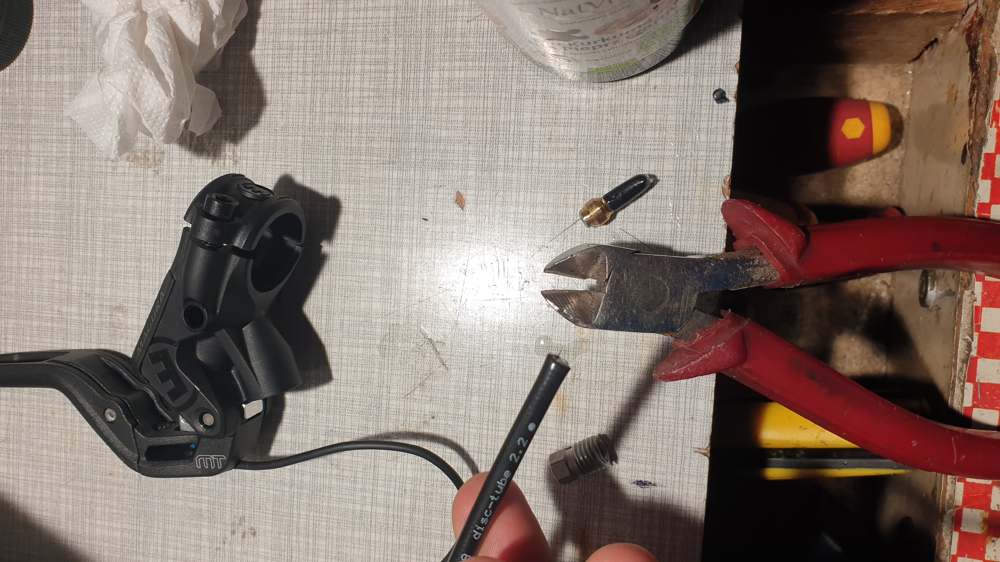
 Now we proceed to dismantle the original brakes - Logans were installed on my scooter.
 Similarly, we unscrew the breathers and brake lines. We take out the brake fluid with a syringe and pour it gently into the container from the hoses.It is worth protecting places exposed to contamination with brake fluid.
 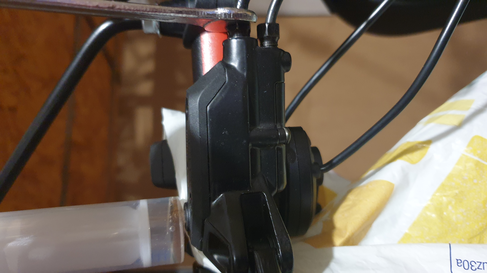
 We cut the end of the brake cable and then use a long wire to pull the cables out of the scooter.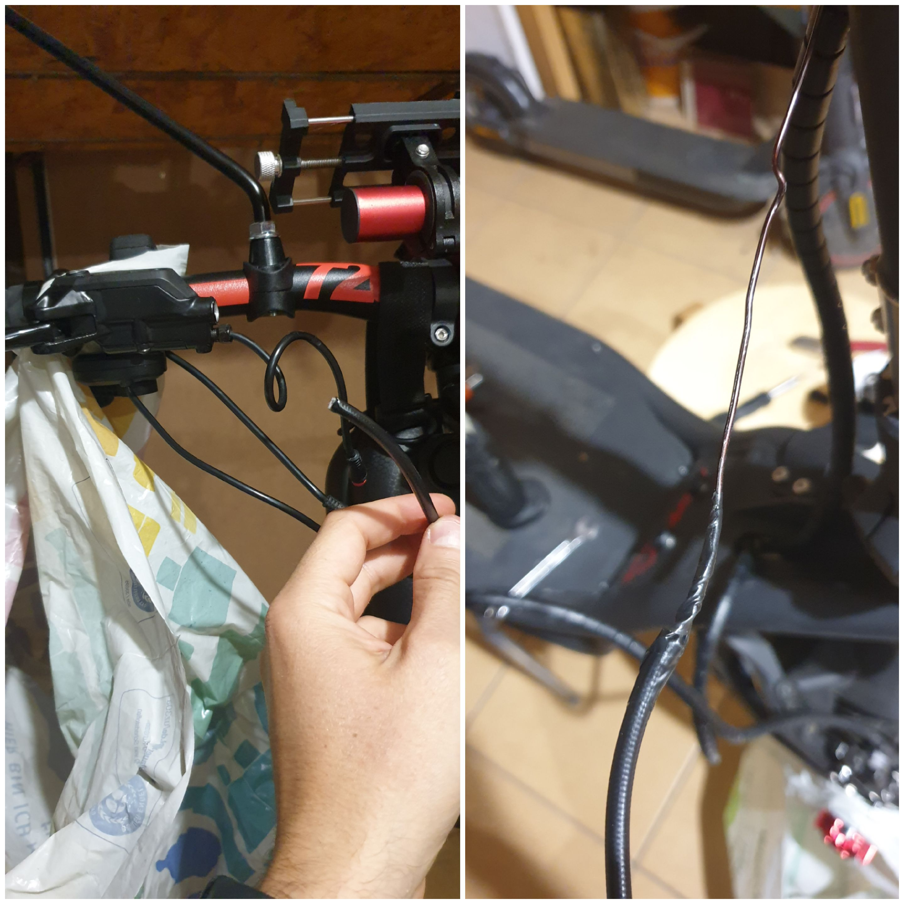
 Important : After removing the brake hoses, the wires should remain in the handlebar post.
 Now we proceed to the installation of adapters and Magura brake calipers. New brake discs can be installed last.
 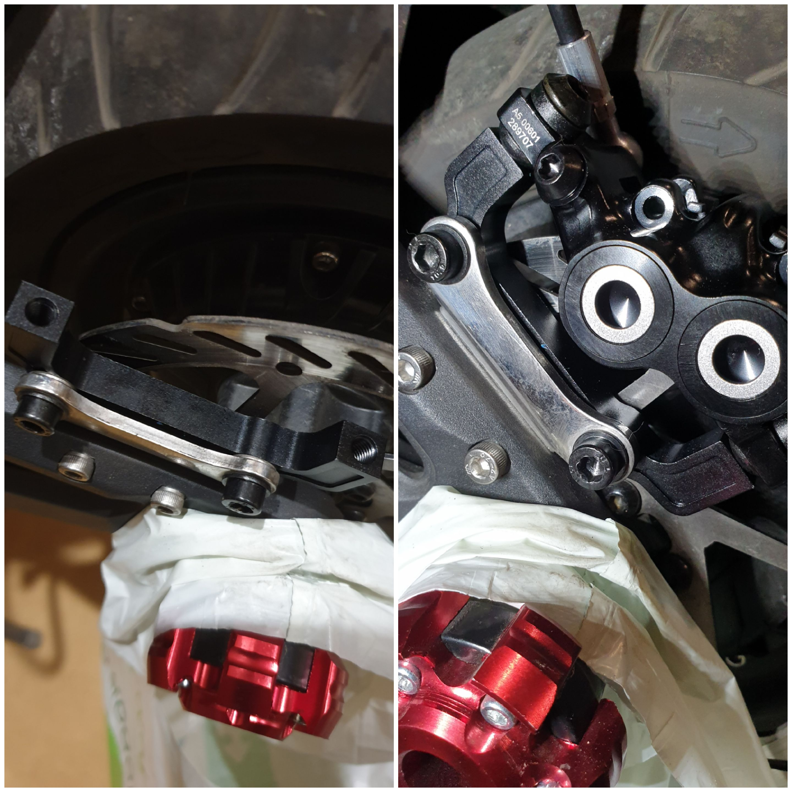
 We lead the brake lines from the calipers carefully through the original places and covers as before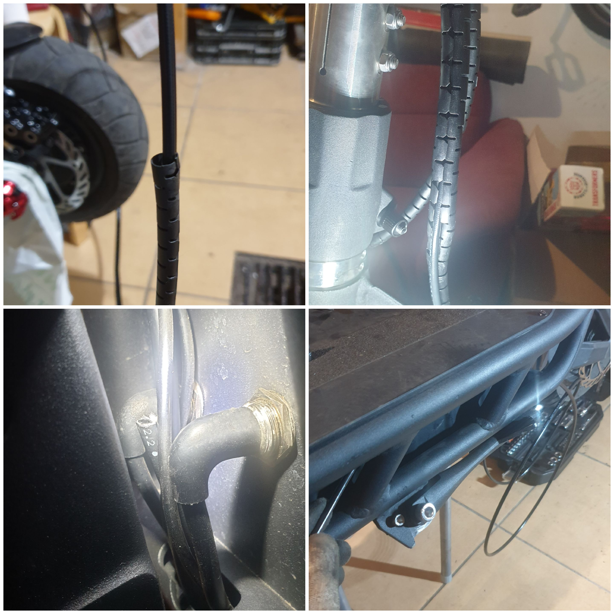
 We install new Magura brake levers to the handlebars. We add the brake hoses to the handles to the appropriate length, remembering to take into account the free reserve - the brake hose must not be too tight. Cut the cable too long. Next, we prepare the cut ends of the wires for assembly in the body of the brake handle. For this purpose, we use new elements included in the Magura brake bleeding kit - a metal tip and a sleeve as in the picture.
 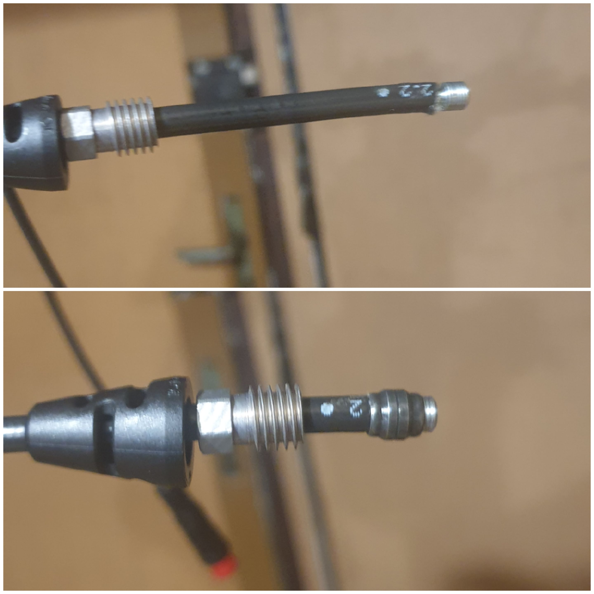
 Then screw the brake hose slowly and sensitively until the screw thread is gently hidden in the body of the handles.
 Important: To ensure a secure connection, you can slightly push the cable to the body of the handles with the other hand while screwing.
 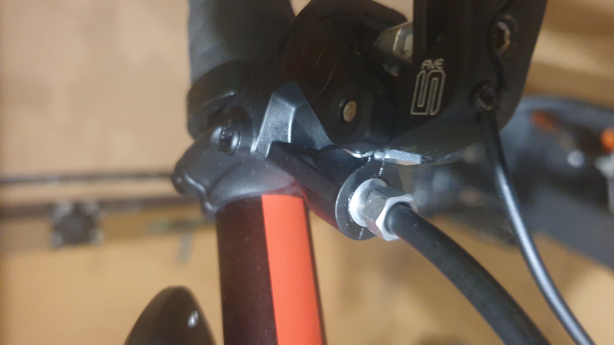
 In my case, only after bleeding the brake calipers, I installed new brake discs. The assembly was carried out on partially disassembled wheels, because the wires from the electric motors remained connected to the controllers.
 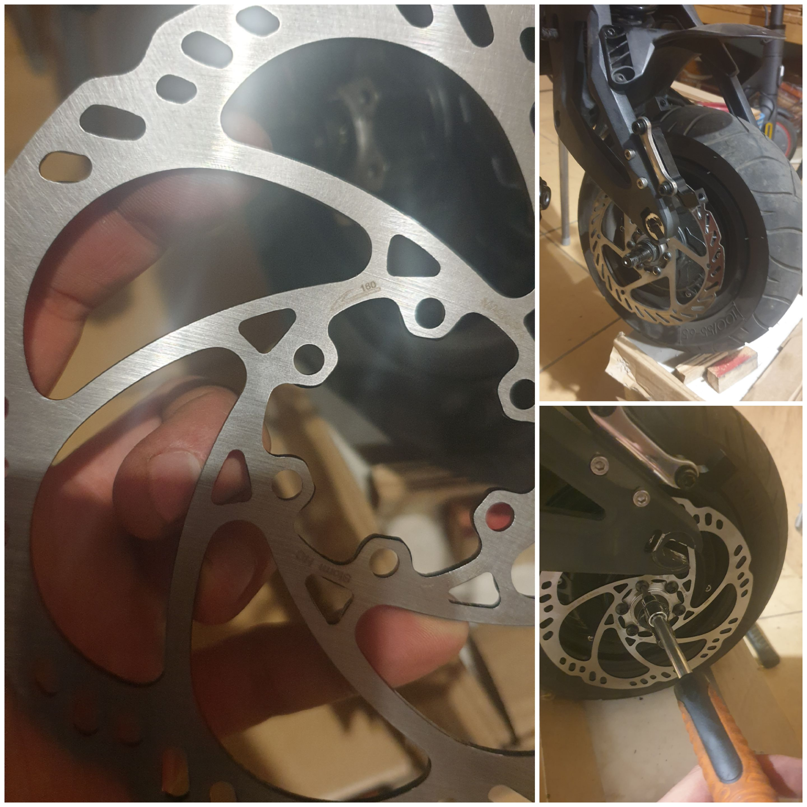
 ## Bleeding procedure
 Starting the process of bleeding the brakes, we need to prepare one syringe with a piece of hose and a connector fitting the thread of the brake calipers - we will find it in the Magura brake bleeding kit. A second empty syringe for transferring brake fluid - preferably with the plunger removed. The brake caliper should be secured at all times with the factory chocks inserted between the brake pads. We assemble the wedges towards the clamp with the thicker side, paying attention so that they do not fall out - it will be helpful to hold the clamp with the whole hand.
 * First, we bleed the front brake caliper. Loosen the handle on the steering wheel and tilt it down slightly, unscrew the air vent gently.
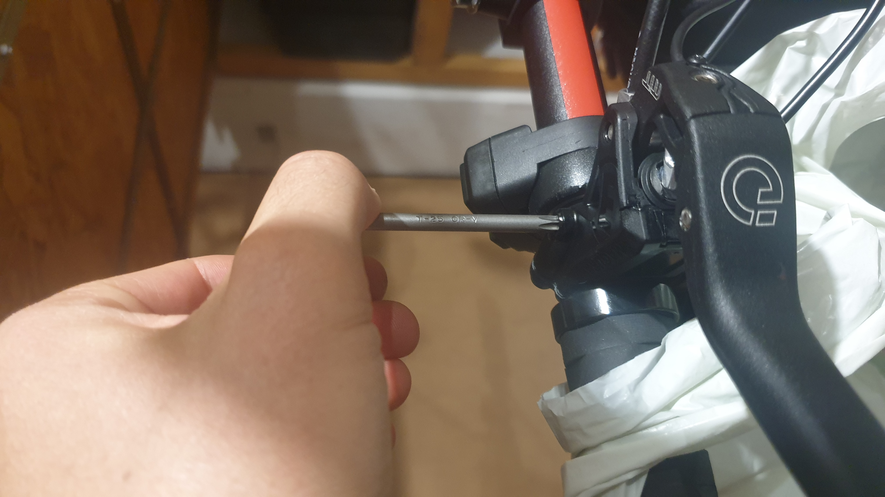
Fill the syringe with the new brake fluid no more than halfway with the new brake fluid and screw it into the brake caliper. Insert the second empty syringe with care into the vent hole of the handle body. Then gently inject the brake fluid. During this time, brake fluid should appear in the second syringe. We stop pumping the brake fluid when more or less in the syringe with which we pump the brake fluid, its level is at the minimum - we do not make the syringe completely empty!! Now, pressing the brake lever several times, we observe the return of the brake fluid with air. Here, too, we make sure that the brake fluid is at the minimum level in the syringe of the handle body.
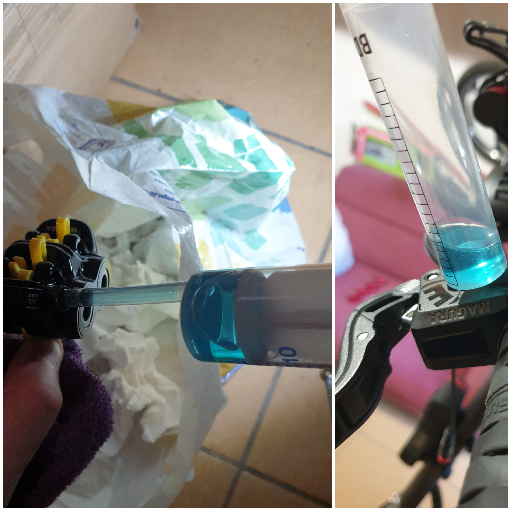
Repeat the process until no air bubbles are visible. In addition, at the very end, when pressing the brake handle, you can gently press the piston rod of the brake caliper syringe with your hand.Finally, to avoid unwanted fluid flow from the system when disconnecting the syringes, first lift the front brake caliper above the height of the handlebar handle. Then we unscrew the syringe with the connector and screw the securing screw to the clamp carefully. Now, in order to safely remove the syringe from the body and not spill excess brake fluid, lower it by turning it down on the handlebar and pour out the fluid content from the syringe. Then we return to the level and pull the syringe. Screw the air vent very gently!!
* In the case of the rear brake caliper, we proceed in the same way. It may be necessary to repeat the procedure two or three times until no more air bubbles appear. This is due to the length of the brake hose. In addition, when unscrewing the syringe from the caliper, we will not avoid the flow of brake fluid. We can minimize this by putting the scooter on its side.
 ## Setting
 Once we have successfully completed the bleeding process and our system is tight, we can start setting the brake calipers. The brake calipers should be aligned vertically and horizontally so that the entire surface of the brake pads covers the brake discs. This has a significant impact on the quality of braking. That is why it is so important to choose the right adapters for Magura brake calipers. Otherwise, you will be forced to mix and match with washers yourself and you may not be able to achieve the intended effect.
 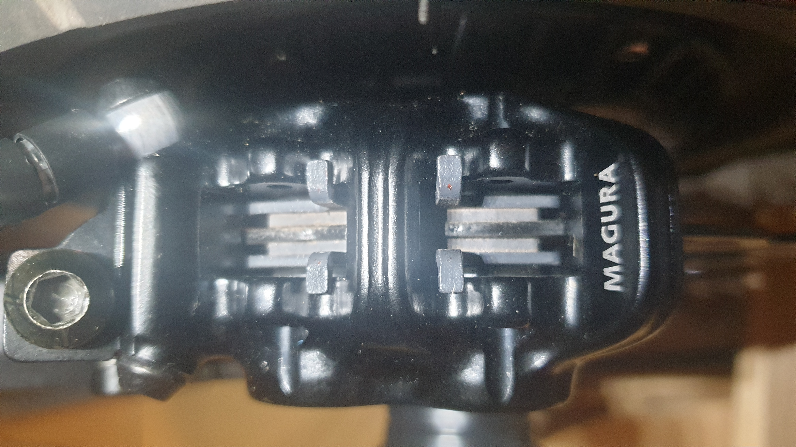
 If you managed to properly mount the Magura MT5e brakes with the help of my guide, from now on you can be sure that the braking quality of your scooter will improve significantly.Safe driving :)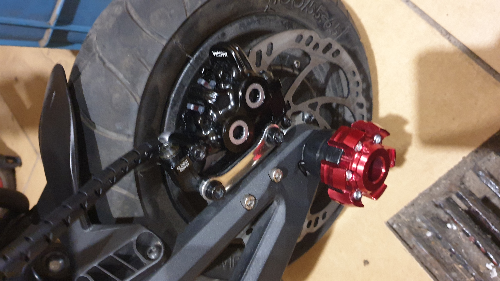
 